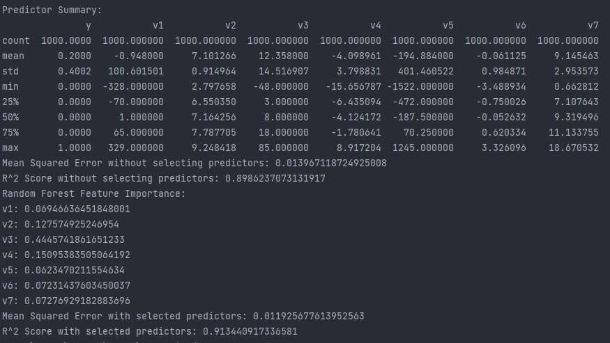

# Crefobirojs

This project analyzes a dataset and builds a predictive model using machine learning algorithms. The goal is to predict the target variable "y" based on multiple predictors (v1, v2, v3, v4, v5, v6, v7).

## Python libraries

To create the model, the following Python libraries were used:

- **pandas**: Data manipulation and analysis
- **numpy**: Numerical operations and array manipulation
- **scikit-learn**: Machine learning library

## Dataset Summary

The dataset consists of 1000 samples with the following summary statistics:

|       |         y |          v1 |          v2 |          v3 |          v4 |           v5 |          v6 |          v7 |
|-------|----------:|------------:|------------:|------------:|------------:|-------------:|------------:|------------:|
| count | 1000.0000 | 1000.000000 | 1000.000000 | 1000.000000 | 1000.000000 |  1000.000000 | 1000.000000 | 1000.000000 |
| mean  |    0.2000 |   -0.948000 |    7.101266 |   12.358000 |   -4.098961 |  -194.884000 |   -0.061125 |    9.145463 |
| std   |    0.4002 |  100.601501 |    0.914964 |   14.516907 |    3.798831 |   401.460522 |    0.984871 |    2.953573 |
| min   |    0.0000 | -328.000000 |    2.797658 |  -48.000000 |  -15.656787 | -1522.000000 |   -3.488934 |    0.662812 |
| 25%   |    0.0000 |  -70.000000 |    6.550350 |    3.000000 |   -6.435094 |  -472.000000 |   -0.750026 |    7.107643 |
| 50%   |    0.0000 |    1.000000 |    7.164256 |    8.000000 |   -4.124172 |  -187.500000 |   -0.052632 |    9.319496 |
| 75%   |    0.0000 |   65.000000 |    7.787705 |   18.000000 |   -1.780641 |    70.250000 |    0.620334 |   11.133755 |
| max   |    1.0000 |  329.000000 |    9.248418 |   85.000000 |    8.917204 |  1245.000000 |    3.326096 |   18.670532 |

## Feature Importance

The Random Forest model identified the importance of each predictor (v1 to v7) in predicting the target variable, with higher values indicating greater significance:

| Feature | Importance |
| ------- | ---------- |
| v1      | 0.069466   |
| v2      | 0.127575   |
| v3      | 0.444574   |
| v4      | 0.150954   |
| v5      | 0.062347   |
| v6      | 0.072314   |
| v7      | 0.072769   |

## Predictor Selection and Model Evaluation

In this project, two models were trained to analyze the values of predictors. Initially, a Random Forest model was chosen as the primary model; however, it fell short of achieving the desired R^2 score of 0.6. To address this, an additional model was introduced. Subsequently, an Ensemble Model approach was employed to combine the predictions from these models, leveraging their individual strengths to enhance overall predictive performance.

### Model Performance without Predictor Selection

The initial model, trained without predictor selection, provided the following results:

    Mean Squared Error: 0.013967
    R^2 Score: 0.898624

### Model Performance with Selected Predictors

The model trained with selected predictors demonstrated improved performance:

    Mean Squared Error: 0.011926
    R^2 Score: 0.913441

Comparing these metrics, it is evident that the model with predictor selection achieved better performance in predicting the target variable.

## Conclusion

The model trained with selected predictors exhibits excellent prediction accuracy, as evidenced by the high R^2 Score of 0.913441. An R^2 Score above 0.9 indicates that over 90% of the variance in the target variable can be explained by the selected predictors. This signifies a strong relationship between the predictors and the target variable, highlighting the model's ability to make highly accurate predictions. With a low Mean Squared Error of 0.011926, the model's predicted values closely align with the actual values.

## Installation

To install the application, follow these steps.

Clone the repository to your local machine using the following command:

    git clone https://github.com/azemitis/crefobirojs.git

Navigate to the project directory:

    cd crefobirojs

Install dependencies:

    pip install pandas numpy scikit-learn

Run application:

    python solution.py

